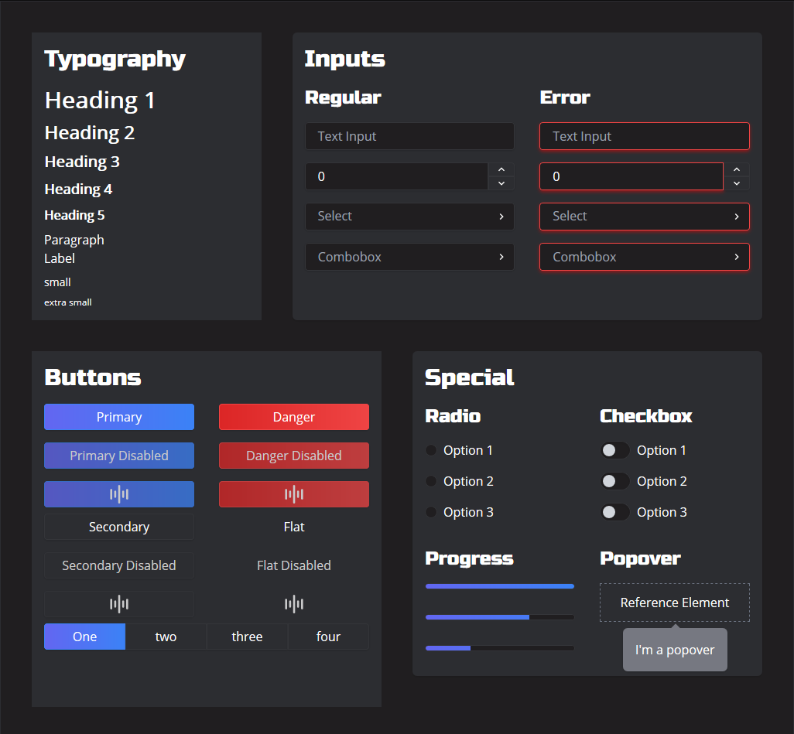

# Rocinante 🚀

Named after the best ship in the galaxy (and beyond the ring), Rocinante is a small and sleek dark mode focused UI library with big guns 💪

<p>
  <a href="https://www.npmjs.com/package/@rocinante/core"></a>
<a href="https://bundlephobia.com/result?p=@rocinante/core@latest"></a>
</p>

## Docs 📕

View Rocinante's living documentation [here](https://rocinantejs.github.io/docs/?path=/docs/rocinante--playground)

## Installation and Usage 🛠

Simply install using npm or yarn

```npm install -S @rocinante/core```

```npm add @rocinante/core```

Import CSS into your application root

```import "@rocinante/core/dist/css/rocinante.css"```

Get coding!

```tsx
import { Button } from "@rocinante/core"

<Button>Click me!</Button>
```

## Screenshots 📷



## Special Thanks ❤

Inspired by Herman Hubanov's [Amaive dashboard concept](https://dribbble.com/shots/5668358-Dashboard-Template-Amaive)
